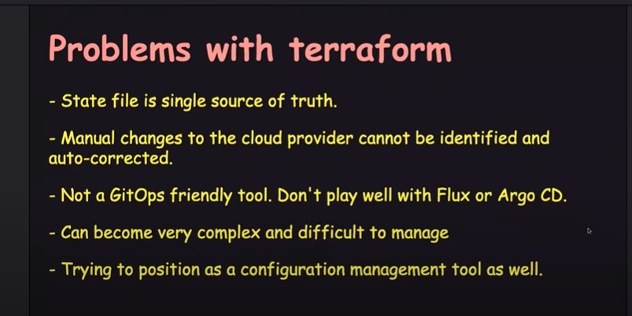

The image outlines several key problems associated with using Terraform, a popular Infrastructure as Code (IaC) tool. Let's break down each of the listed problems and explain them in detail:

### 1. **State File is a Single Source of Truth**
   - **Explanation**: In Terraform, the state file (`terraform.tfstate`) is the only record of your infrastructure's current state. It tracks all the resources that Terraform manages. 
   - **Problem**: If this state file is corrupted, lost, or incorrectly modified, it can lead to serious issues, such as Terraform being unable to accurately manage or update the infrastructure. This makes the state file a critical single point of failure.

### 2. **Manual Changes to the Cloud Provider Cannot be Identified and Auto-Corrected**
   - **Explanation**: Terraform manages infrastructure based on the state file and the configurations defined in your `.tf` files.
   - **Problem**: If someone manually changes infrastructure directly in the cloud provider's console (e.g., AWS), Terraform will not automatically detect or correct these changes. This can cause discrepancies between what Terraform thinks the infrastructure looks like (according to the state file) and the actual state of the infrastructure, leading to potential errors when applying future changes.

### 3. **Not a GitOps Friendly Tool. Doesn’t Play Well with Flux or Argo CD**
   - **Explanation**: GitOps is a practice where the Git repository is the single source of truth, and any changes to infrastructure are made through pull requests, which are then automatically applied to the environment.
   - **Problem**: Terraform doesn’t integrate smoothly with GitOps tools like Flux or Argo CD, which are designed to automate the deployment of applications based on changes in Git. This lack of compatibility makes it harder to incorporate Terraform into a fully automated GitOps workflow.

### 4. **Can Become Very Complex and Difficult to Manage**
   - **Explanation**: Terraform is very powerful and can manage complex infrastructures. However, as the infrastructure grows in size and complexity (especially across multiple accounts or environments), managing it with Terraform can become challenging.
   - **Problem**: The complexity of managing large infrastructures with Terraform can lead to difficulties in maintaining and scaling your IaC. It can also increase the chances of errors and make troubleshooting more complicated.

### 5. **Trying to Position as a Configuration Management Tool as Well**
   - **Explanation**: Terraform is designed primarily for infrastructure provisioning (creating and managing cloud resources).
   - **Problem**: Recently, some use cases and practices have emerged where Terraform is used for tasks typically handled by configuration management tools like Ansible (e.g., configuring servers, deploying applications). This blurs the lines between infrastructure provisioning and configuration management, which can lead to misuse or confusion about the best tool for a given task.

### **Summary**
The points in the image highlight some of the practical challenges of using Terraform in real-world scenarios. While Terraform is a powerful tool for managing infrastructure as code, it has its limitations, especially when it comes to state management, handling manual changes, integrating with GitOps practices, and managing large, complex infrastructures. Understanding these challenges is crucial for effectively using Terraform and addressing potential issues in your infrastructure workflows.