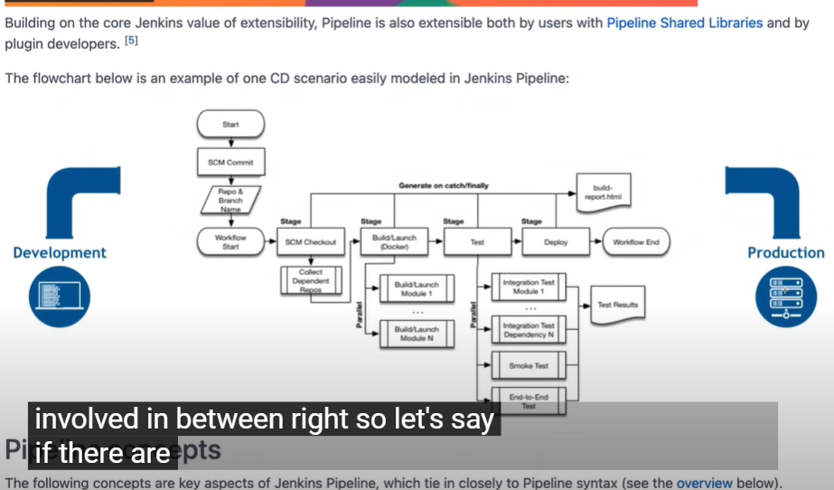

The image you've provided shows a Jenkins pipeline flowchart, illustrating a typical Continuous Delivery (CD) scenario. Let’s break down each step of this pipeline, explain the working behind it, and discuss the purpose of each stage.

### **Step-by-Step Breakdown of the Pipeline:**

1. **Start (SCM Commit):**
   - **Explanation:** The process begins when a developer commits code changes to a Source Code Management (SCM) system like Git.
   - **Purpose:** This step triggers the Jenkins pipeline to start the build and deployment process.
   - **Command Example:** `git commit -m "Commit message"` followed by `git push`.

2. **Repo & Branch Name:**
   - **Explanation:** Jenkins identifies which repository and branch to work with based on the commit.
   - **Purpose:** To ensure that the pipeline is working with the correct version of the code.
   - **Command Example:** This is typically configured in the Jenkins job itself, where you define the repository URL and branch.

3. **Workflow Start:**
   - **Explanation:** This indicates the initiation of the workflow within Jenkins.
   - **Purpose:** It's a marker that shows the pipeline has begun executing the defined stages.

4. **SCM Checkout:**
   - **Explanation:** Jenkins checks out the code from the SCM system to the build environment.
   - **Purpose:** To bring the latest version of the code from the repository into the environment where the pipeline will run.
   - **Command Example:** `git checkout branch-name`.

5. **Collect Dependent Repos:**
   - **Explanation:** If the project relies on other repositories, Jenkins gathers these dependencies.
   - **Purpose:** To ensure that all required components are available for the build process.
   - **Command Example:** Cloning other required repositories using `git clone` or downloading dependencies via package managers like `npm` or `pip`.

6. **Stage - Build/Launch (Docker):**
   - **Explanation:** The project is built, often within a Docker container to ensure consistency across environments.
   - **Purpose:** Using Docker allows the pipeline to have a consistent and isolated environment for building the application.
   - **Command Example:**
     - **Docker Build:** `docker build -t myapp .`
     - **Docker Run:** `docker run myapp`

7. **Stage - Build/Launch Modules:**
   - **Explanation:** If the project consists of multiple modules, each is built and launched separately.
   - **Purpose:** This modular approach allows for easier debugging and more organized builds.
   - **Command Example:** Running build commands for each module, such as `mvn package` for Maven projects or `npm run build` for Node.js modules.

8. **Stage - Test:**
   - **Explanation:** Various tests (unit, integration, etc.) are run to ensure the application functions correctly.
   - **Purpose:** To catch bugs or issues before the code is deployed to production.
   - **Command Example:** Running tests using frameworks like JUnit for Java (`mvn test`), Jest for JavaScript (`npm test`), or `pytest` for Python.

9. **Stage - Deploy:**
   - **Explanation:** Once the build and tests are successful, the application is deployed to a staging or production environment.
   - **Purpose:** To make the application available for further testing or for end-users.
   - **Command Example:**
     - **Docker Deploy:** `docker-compose up`
     - **Kubernetes Deploy:** `kubectl apply -f deployment.yaml`

10. **Integration Test Modules:**
    - **Explanation:** After deployment, integration tests are run to ensure the application works with other systems.
    - **Purpose:** To verify that the new code integrates well with other components.
    - **Command Example:** Running integration tests using tools like Postman for API testing or Selenium for UI testing.

11. **Smoke Test, End-to-End Test:**
    - **Explanation:** Smoke tests ensure that the basic functionality works, and end-to-end tests simulate real user interactions.
    - **Purpose:** To perform quick checks (smoke tests) and thorough checks (end-to-end tests) before final deployment.
    - **Command Example:** Automated tests using Selenium or Cypress for end-to-end testing.

12. **Test Results:**
    - **Explanation:** The results of all tests are collected and reported.
    - **Purpose:** To provide feedback on the success or failure of the tests, guiding further actions.
    - **Output Example:** Test reports are usually generated in formats like JUnit XML, HTML, or plain text.

13. **Workflow End:**
    - **Explanation:** Marks the end of the pipeline process.
    - **Purpose:** To indicate that all stages have been completed, and the pipeline has finished its execution.

14. **Build Report (HTML):**
    - **Explanation:** A summary report is generated, often in an HTML format, detailing the build and test results.
    - **Purpose:** To provide a detailed overview of what happened during the pipeline execution.
    - **Output Example:** An HTML file that can be viewed in a web browser, showing the success/failure of each stage and test.

### **Purpose of the Pipeline:**

- **Automation:** This pipeline automates the process of building, testing, and deploying code, ensuring consistency and reducing manual effort.
- **Consistency:** Using tools like Docker ensures that the build environment is consistent, reducing issues related to environment differences.
- **Efficiency:** By breaking the pipeline into stages, it’s easier to manage, debug, and scale the process.
- **Scalability:** Modular builds and tests allow teams to scale their applications and pipelines as projects grow.

### **Real-Life Scenario:**

Consider a company developing a web application. Every time a developer pushes code to the repository, this pipeline ensures that the code is automatically built, tested, and deployed. If any tests fail, the process stops, and developers are notified to fix the issues before proceeding. This ensures that only stable code makes it to production, reducing downtime and improving the quality of the software.