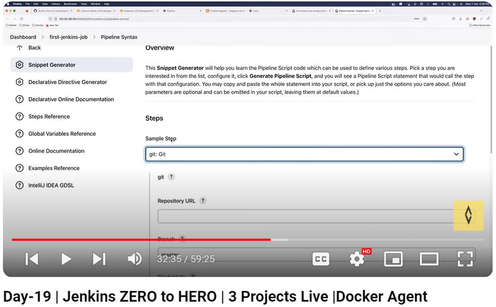
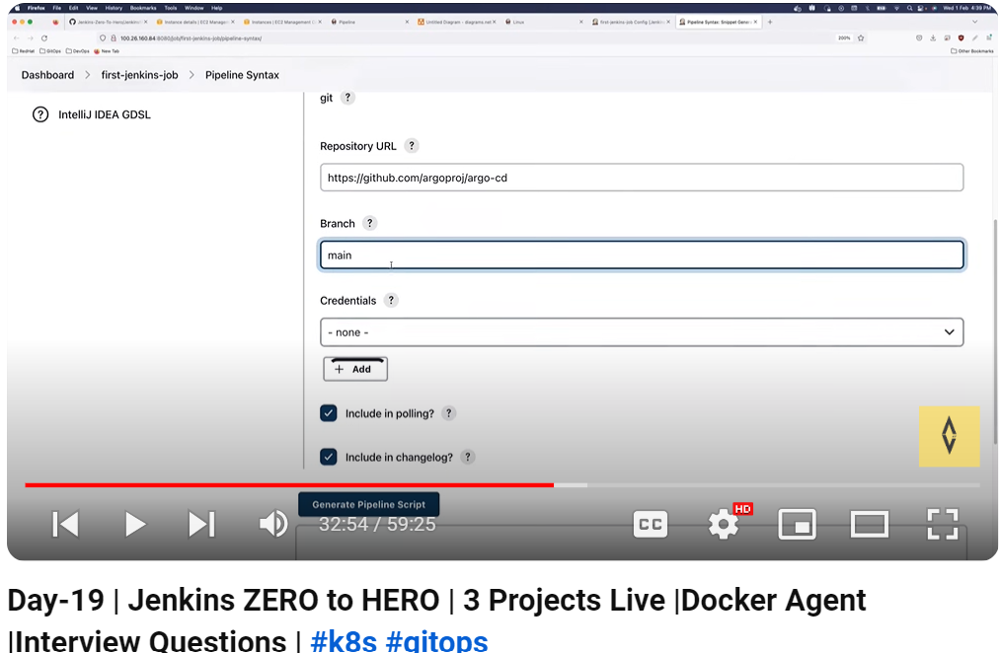
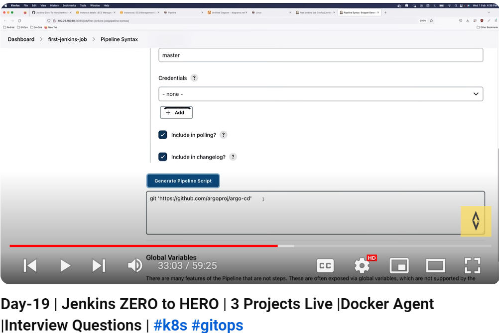
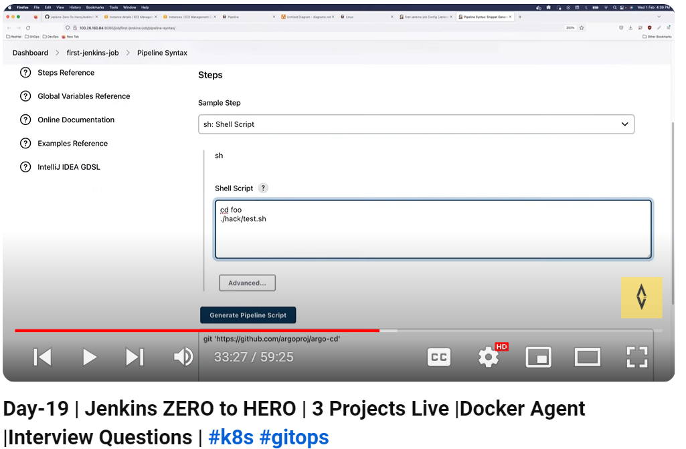
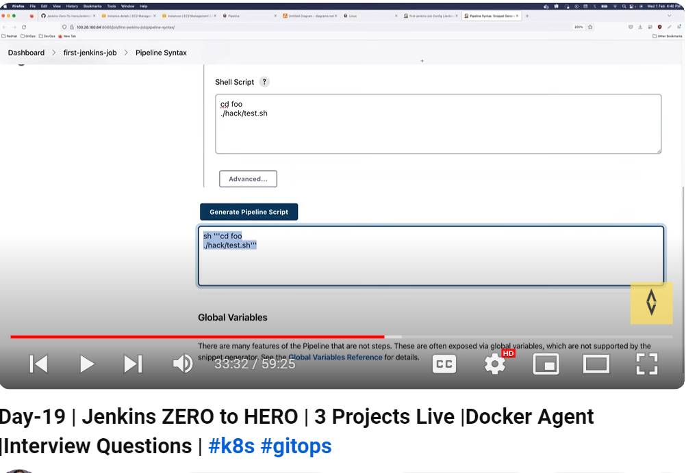

Sure! Here’s a step-by-step explanation of how to set up a Jenkins pipeline that checks out code from a GitHub repository and runs shell scripts. This process will guide you through practical steps without the need for deep technical knowledge.

### Setting Up Your Jenkins Pipeline

#### Step 1: Access Jenkins
1. **Open your Jenkins Dashboard** in your web browser.

#### Step 2: Create a New Pipeline Job
1. Click on **"New Item"** in Jenkins.
2. Enter a name for your job (e.g., "MyFirstPipeline").
3. Select **"Pipeline"** from the list of item types.
4. Click **"OK"** to proceed.

#### Step 3: Configure the Pipeline
1. In the job configuration page, find the **"Pipeline"** section.
2. Instead of writing a script directly, select **"Pipeline script from SCM"**.

#### Step 4: Provide Source Code Management Details
1. **SCM**: Choose **Git** from the dropdown.
2. **Repository URL**: Enter the URL of your GitHub repository (e.g., `https://github.com/argo-project/argo-cd`).
 
 
 
3. **Credentials**: If your repository is public, leave it blank. For private repositories, select the credentials you have stored in Jenkins.
4. **Branch**: Enter the branch you want to work on (e.g., `main` or `master`).
5. **Script Path**: If your `Jenkinsfile` is located in a subfolder, specify the path (e.g., `my_first_pipeline/Jenkinsfile`).

#### Step 5: Save the Configuration
1. Click the **"Save"** button.

### Step 6: Use Jenkins Pipeline Syntax Generator
1. Navigate to the **"Pipeline Syntax"** link on the Jenkins dashboard (usually located in the left sidebar).
2. Use the generator to create your Git checkout command:
   - **Select** "git" from the dropdown.
   - **Input your repository URL**, branch, and credentials if necessary.
   - Click on **"Generate Pipeline Script"**.
   - Copy the generated script.



### Step 7: Running Shell Scripts
1. Still in the "Pipeline Syntax" section, choose **"sh"** for shell scripts next.
2. Enter your shell command (e.g., change directory and run a script):
   ```bash
   cd Foo
   ./hack_test.sh
   ```
3. Click **"Generate Pipeline Script"** and copy the generated code.

### Step 8: Build the Final Jenkinsfile
1. Go back to your job configuration.
2. Construct your Jenkinsfile using the copied scripts as follows:
   ```groovy
   pipeline {
       agent any
       stages {
           stage('Checkout') {
               steps {
                   git url: 'https://github.com/argo-project/argo-cd', branch: 'main'
               }
           }
           stage('Run Shell Script') {
               steps {
                   sh '''
                       cd Foo
                       ./hack_test.sh
                   '''
               }
           }
       }
   }
   ```
3. Paste it in the Jenkinsfile section if it's present or within GitHub if your Jenkinsfile is stored in your repository.

### Step 9: Execute the Job
1. Go back to your Jenkins job dashboard.
2. Select **"Build Now"** to run your pipeline.

### Step 10: Monitor the Pipeline
1. Click on the build number (e.g., #1) under "Build History" to see the process.
2. Check the **"Console Output"** to view logs and validate your pipeline steps.

### Additional Notes
- **EC2 Instances**: If you're running Jenkins on an EC2 instance, this will be where the main job executions happen.
- **Extra Configuration**: If you need multiple environments or builds to run simultaneously, consider setting up Jenkins agents or worker nodes.

This step-by-step guide should help simplify the process of setting up your Jenkins pipeline, making it easier to integrate GitHub and manage shell scripts. If you have further questions or require clarification on any steps, feel free to ask!

--------------------------------------------------------------------------------------------------------------------------------
# OR
--------------------------------------------------------------------------------------------------------------------------------

It looks like you're describing a process for setting up a Jenkins pipeline that checks out a project from GitHub, executes shell scripts, and utilizes Jenkins' features to generate pipeline scripts easily using navigation and code generation utilities. Let's summarize and clarify the steps you're discussing for constructing this Jenkins pipeline.

### Steps for Setting Up a Jenkins Pipeline from GitHub

1. **Accessing Jenkins Pipeline Syntax Generator**:
   - In Jenkins, go to the "Pipeline Syntax" option. This will help you generate snippets of Groovy code for your pipeline tasks without having to remember the syntax.
   
2. **Checkout Code from GitHub**:
   - Specify the repository URL (e.g., `https://github.com/argo-project/argo-cd.git`).
   - Specify the branch you want to work on (e.g., `main` or `master`).
   - If your GitHub repository requires authentication, you can set the necessary credentials in Jenkins.
   - Click on "Generate Pipeline Script" to get the Groovy code for the checkout operation, which you can then add to your Jenkinsfile.

   Example syntax:
   ```groovy
   stage('Checkout') {
       steps {
           git branch: 'main', url: 'https://github.com/argo-project/argo-cd.git'
       }
   }
   ```

3. **Running Shell Scripts**:
   - Again in the "Pipeline Syntax" section, search for the option to run shell scripts.
   - Specify your shell commands, such as changing directories and executing a script.
   - Generate the pipeline syntax for the shell step and include it in your Jenkinsfile.

   Example syntax:
   ```groovy
   stage('Run Shell Script') {
       steps {
           sh '''
               cd Foo
               ./hack_test.sh
           '''
       }
   }
   ```

4. **Creating the Jenkins Job**:
   - In Jenkins, create a new pipeline job.
   - Instead of using a direct script, choose the option to pull the pipeline script from your SCM.
   - Enter the repository URL and specify the branch.
   - Specify the path to the Jenkins file, which might be something like `my_first_pipeline/Jenkinsfile`.
   
5. **Execution of the Pipeline**:
   - After saving the job configuration, you will trigger the job to start running.
   - The pipeline will execute the stages as defined in the Jenkinsfile, checking out the code, running tests, and performing any other specified tasks.

### Understanding the Jenkins Environment

- **Master Node**: The Jenkins master is responsible for scheduling jobs and managing the distribution of builds to agents (worker nodes).
  
- **Agent Nodes**: If you need to run builds on multiple environments (like running on EC2 instances), you may configure agent nodes where the actual build steps will be executed.

### Tips for Using Jenkins Pipeline

- **Jenkinsfile**: Keep your Jenkinsfile in your source control for versioning and ease of updates.
  
- **Pipeline Syntax Generator**: Use this built-in tool to learn and generate the necessary code snippets for your Jenkinsfile without memorizing every detail of the Groovy syntax.

- **Monitoring and Logging**: Regularly check the Jenkins console output to monitor the builds and catch any issues early on.

This approach simplifies the setup of Jenkins pipelines by leveraging the built-in syntax generator and following a structured process for creating, configuring, and executing pipelines. If you have any questions or need further clarification on any specific part, feel free to ask!
