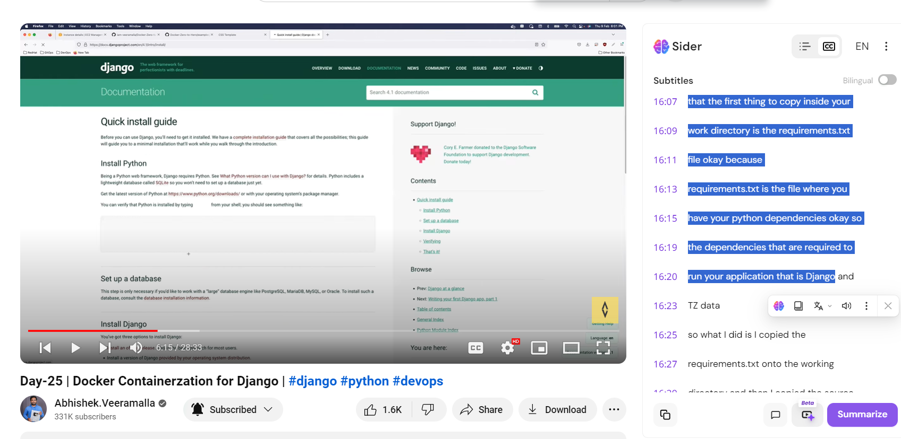

Let's break down the provided text into detailed concepts, explanations, commands, and scenarios for each section related to Docker, its role in containerization, and the responsibilities of a DevOps engineer.

### 1. **What Does Docker Do?**
   - **Concept**: Docker is a platform that allows developers to automate the deployment of applications inside lightweight, portable containers. These containers can run on virtual machines or directly on physical servers (bare metal).
   - **Purpose**: Docker consumes resources from the host operating system while isolating the application's dependencies within the container. This ensures consistency across different environments.
   - **Key Points**:
     - Docker containers include all necessary dependencies for an application.
     - Only minimal interactions with the host OS are required, such as system calls to the kernel.

### 2. **Containerization Benefits**
   - **Concept**: Containers solve the classic problem of "it works on my machine" by packaging applications with their dependencies.
   - **Purpose**: This eliminates discrepancies between development, testing, and production environments, making deployment more reliable.
   - **Scenario**: A developer can create a Docker container that includes Python and specific libraries, ensuring that anyone who runs the container will have the same environment.

### 3. **Roles and Responsibilities of a DevOps Engineer**
   - **Concept**: A DevOps engineer is responsible for containerizing applications, which involves understanding the application’s workflow and dependencies.
   - **Purpose**: This role bridges the gap between development and operations, ensuring smooth deployments and maintenance of applications.
   - **Task Example**: A DevOps engineer might receive a request (e.g., a Jira ticket) to containerize a Django application, requiring them to analyze the application’s structure and dependencies.

### 4. **Writing a Dockerfile**
   - **Concept**: A Dockerfile is a text document that contains all the commands to assemble an image. It defines how the application will run inside the container.
   - **Purpose**: The Dockerfile specifies the base image, working directory, and commands to install dependencies and copy application code.
   - **Command Example**:
     ```dockerfile
     FROM ubuntu:latest
     WORKDIR /app
     COPY requirements.txt .
     RUN apt-get update && apt-get install -y python3-pip
     RUN pip3 install -r requirements.txt
     ```
   - **Scenario**: This Dockerfile sets up an Ubuntu base image, creates a working directory at `/app`, and installs Python dependencies listed in `requirements.txt`.

### 5. **Choosing a Base Image**
   - **Concept**: The base image is the starting point for building a Docker container. Common choices include Ubuntu, CentOS, or Alpine.
   - **Purpose**: The choice of base image affects the size, performance, and available packages in the container.
   - **Scenario**: If using CentOS instead of Ubuntu, the commands to install packages would differ (e.g., using `yum` instead of `apt-get`).

### 6. **Setting the Working Directory**
   - **Concept**: The `WORKDIR` instruction sets the working directory for any subsequent commands in the Dockerfile.
   - **Purpose**: It provides a consistent location for your application code, making it easier to manage multiple projects.
   - **Command Example**:
     ```dockerfile
     WORKDIR /app
     ```
   - **Scenario**: All commands following the `WORKDIR` instruction will be executed in the `/app` directory, ensuring that files are organized and accessible.

### 7. **Copying Dependencies**
   - **Concept**: The `COPY` command in the Dockerfile is used to copy files from the host machine into the Docker image.
   - **Purpose**: Copying the `requirements.txt` file first allows Docker to cache the installation of dependencies, speeding up builds when code changes but dependencies remain the same.
   - **Command Example**:
     ```dockerfile
     COPY requirements.txt .
     ```
   - **Scenario**: By copying `requirements.txt`, you ensure that the necessary Python packages are installed in the container.

### 8. **Installing Dependencies**
   - **Concept**: The `RUN` command executes commands in the container during the image build process.
   - **Purpose**: This is where you install the necessary packages and dependencies required for your application to run.
   - **Command Example**:
     ```dockerfile
     RUN pip3 install -r requirements.txt
     ```
   - **Scenario**: This command installs all Python packages listed in `requirements.txt`, ensuring the application has everything it needs to function correctly.

### Conclusion
By understanding these concepts and commands, you can effectively utilize Docker for containerization, ensuring that applications run consistently across different environments. The role of a DevOps engineer is crucial in this process, as they facilitate the integration of development and operations through containerization practices. This foundational knowledge is essential for successful application deployment and management in modern software development.
