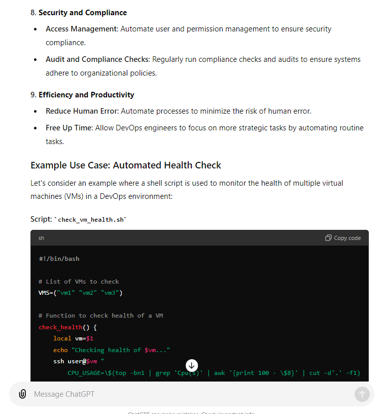
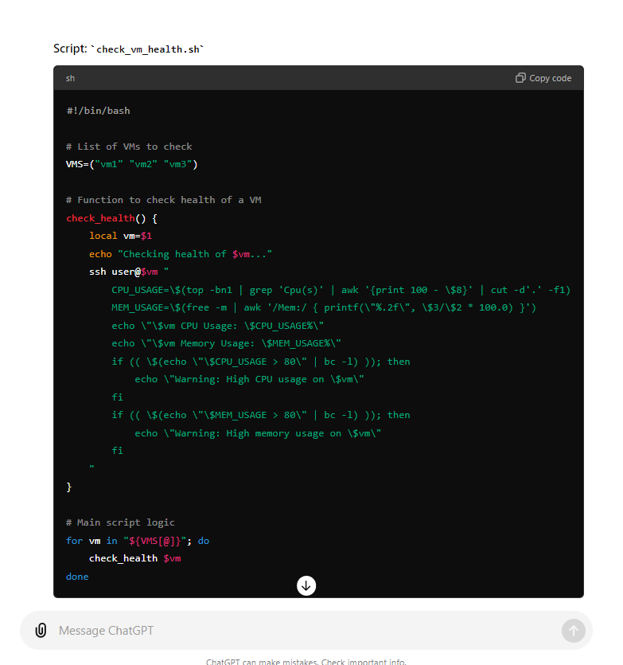
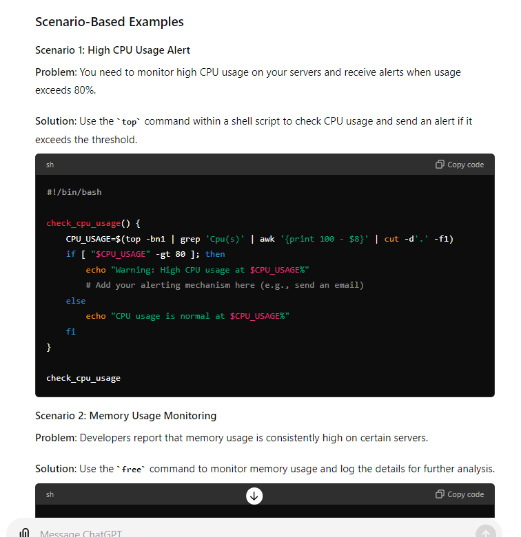

# Drive link: 
https://docs.google.com/document/d/1En16BlE6vK31i5t1H0hYGbI0-JUYIqCnt1Hcn2VbviE/edit?usp=sharing

Sure, let's break down the concepts and instructions given in your text to understand shell scripting from a DevOps engineer's perspective in a detailed and step-by-step manner.

### 1. Introduction to Shell Scripting
Shell scripting is a way to automate tasks on a Linux-based system by writing scripts that run in the shell (command-line interface). For DevOps engineers, shell scripting is crucial as it helps automate repetitive tasks, manage systems, and streamline workflows.

### 2. Importance of Shell Scripting for DevOps Engineers
- **Automation**: DevOps engineers use shell scripting to automate routine tasks, reducing manual effort and minimizing errors.
- **Efficiency**: Scripts can perform tasks faster and more consistently than manual operations.
- **Integration**: Shell scripts can be used to integrate different tools and processes within the DevOps pipeline.

### 3. Basics of Automation
Automation involves creating scripts or tools to perform tasks that would otherwise be done manually. For example, generating a list of numbers, creating multiple files, or managing system configurations can be automated using shell scripts.

### 4. Simple Example of Automation
To illustrate, let's say you need to print numbers from 1 to 10:
```sh
for i in {1..10}; do
  echo $i
done
```
This script uses a loop to print numbers from 1 to 10.

### 5. Scaling Automation
As tasks become more complex, automation becomes essential. For example, creating 1000 files manually is impractical. A shell script can handle this efficiently:
```sh
for i in {1..1000}; do
  touch file_$i.txt
done
```
This script creates 1000 files named `file_1.txt` to `file_1000.txt`.

### 6. Setting Up Your Environment
To start writing and executing shell scripts, you need a Linux environment. This can be:
- A Linux virtual machine on your local machine using virtualization software like Oracle VirtualBox.
- A cloud-based Linux instance on platforms like AWS.

### 7. Creating Your First Shell Script
To create and run a shell script, follow these steps:

**Step 1: Open Terminal**
- On Linux or Mac, open the terminal directly.
- On Windows, you might need to use a Linux subsystem or a virtual machine.

**Step 2: Create a Shell Script File**
- Use the `touch` command to create a new file:
  ```sh
  touch first_script.sh
  ```
  This command creates an empty file named `first_script.sh`.

**Step 3: Write Your Script**
- Open the file with a text editor, such as `nano` or `vi`:
  ```sh
  nano first_script.sh
  ```
- Add the following script to print "Hello, World!":
  ```sh
  #!/bin/bash
  echo "Hello, World!"
  ```
  The `#!/bin/bash` line specifies the script should be run using the bash shell.

**Step 4: Make the Script Executable**
- Change the file's permissions to make it executable:
  ```sh
  chmod +x first_script.sh
  ```

**Step 5: Run the Script**
- Execute the script by typing:
  ```sh
  ./first_script.sh
  ```
  This runs the script and prints "Hello, World!" to the terminal.

### 8. Understanding Shell Scripting Components
- **Shebang (`#!/bin/bash`)**: Indicates the script should be run in the bash shell.
- **Commands**: Each line in the script can be a command that you would typically run in the terminal.
- **Variables**: Store data for use in your script.
  ```sh
  name="John"
  echo "Hello, $name"
  ```
- **Loops**: Repeat a set of commands.
  ```sh
  for i in {1..5}; do
    echo "Number $i"
  done
  ```
- **Conditionals**: Perform actions based on conditions.
  ```sh
  if [ $name == "John" ]; then
    echo "Hello, John"
  else
    echo "Hello, Stranger"
  fi
  ```

### 9. Advanced Shell Scripting
Advanced scripts might include:
- **Functions**: Define reusable code blocks.
  ```sh
  function greet {
    echo "Hello, $1"
  }
  greet John
  ```
- **Error Handling**: Manage errors and exceptions.
  ```sh
  if [ -f "file.txt" ]; then
    echo "File exists"
  else
    echo "File does not exist"
  fi
  ```
- **Integrating with Other Tools**: Use shell scripts to interact with other tools and services, like Docker, Kubernetes, and cloud services.

### 10. Conclusion
Shell scripting is a powerful tool for DevOps engineers, allowing them to automate tasks, manage systems, and integrate various tools and services. Starting with basic scripts and progressively learning more advanced techniques will enable you to leverage the full power of shell scripting in your DevOps workflows.

By following these steps and understanding the concepts, you'll be well-equipped to start writing and using shell scripts effectively in your DevOps role.


-----------------------------------------------------------------------------------------------------------------
Let's break down the provided text into a step-by-step detailed explanation, focusing on understanding shell scripting from a DevOps engineer's perspective.

### 1. Introduction to Shell Scripting for DevOps Engineers

**Overview:**
- **Objective:** Understand shell scripting and its importance for DevOps engineers.
- **Key Points:**
  - Definition of shell scripting.
  - The role of shell scripting in DevOps.
  - Introduction to basic and advanced shell scripting concepts.
  - Practical examples and timestamps for easy navigation.

### 2. What is Shell Scripting?

**Definition:**
- Shell scripting is the process of writing a series of commands for the shell to execute. It automates repetitive tasks and can manage system operations.

**Purpose:**
- Automation to reduce manual activities.

### 3. Importance of Shell Scripting for DevOps Engineers

**Role in DevOps:**
- Automates repetitive tasks on Linux machines.
- Manages configurations, deployments, and other system operations.

**Common Use Cases:**
- Creating multiple files.
- Managing system processes.
- Configuring environments.

### 4. Basics of Automation

**Understanding Automation:**
- Automation reduces manual effort and increases efficiency.
- Relevant across various fields, not limited to DevOps or software.

### 5. Practical Example of Automation

**Example Scenario:**
- Manually writing numbers from 1 to 10 using the `echo` command.
- Scaling up the task to larger numbers, demonstrating the impracticality of manual repetition.
- Automating the task to handle larger scales efficiently.

**Example Commands:**
- Using `echo` to print numbers.
- Using loops to automate the printing of numbers.

### 6. Automating File Creation

**Scenario:**
- Creating multiple files (e.g., 100 or 1000 files) on a Linux machine.

**Command:**
- `touch` command to create files.

**Example:**
- Automating the creation of multiple files using a shell script.

### 7. Why Shell Scripting?

**Purpose:**
- Shell scripting is essential for automating tasks, especially when dealing with repetitive or large-scale operations.

**Application:**
- Used on Linux machines, whether on local systems or cloud platforms like AWS.

### 8. Writing Your First Shell Script

**Steps:**
1. **Preparation:**
   - Ensure access to a Linux environment (e.g., local installation, cloud VM, or virtual machine using Oracle VirtualBox).
2. **Creating a Script File:**
   - Use the `touch` command to create a file with a `.sh` extension.
     ```bash
     touch first_shell_script.sh
     ```
3. **Listing Files:**
   - Use the `ls` command to list files in the directory.
     ```bash
     ls
     ```

**Environment Setup:**
- For Windows users, creating an AWS account and setting up a Linux VM is recommended for following along with examples.

### 9. Basic Shell Scripting Commands

**Common Commands:**
- `echo`: Prints text to the terminal.
  ```bash
  echo "Hello, World!"
  ```
- `touch`: Creates an empty file.
  ```bash
  touch newfile.txt
  ```
- `ls`: Lists files in the directory.
  ```bash
  ls
  ```

### 10. Writing and Executing a Shell Script

**Script Structure:**
- Scripts are written in a plain text file with a `.sh` extension.
- The first line usually specifies the shell to use (e.g., `#!/bin/bash`).

**Example Script:**
```bash
#!/bin/bash
echo "This is my first shell script!"
```

**Execution:**
- Make the script executable and run it.
 ```bash
  chmod +x first_shell_script.sh
  ./first_shell_script.sh
  ```

### 11. Conclusion

**Summary:**
- Shell scripting is a powerful tool for DevOps engineers, enabling automation of tasks and efficient system management.
- It involves writing scripts to execute commands on a Linux shell, reducing manual effort and increasing productivity.

This detailed breakdown provides a clear and comprehensive understanding of shell scripting from a DevOps perspective, covering its definition, importance, practical applications, and basic commands.

----------------------------------------------------------------------------------------------------

Let's break down the provided text into a detailed step-by-step explanation:

### 1. Basic Requirements for Writing a Shell Script

**Objective:**
- To write a shell script, you first need to create a file.

### 2. Creating a File on a Linux Machine

**Command to Create a File:**
- Use the `touch` command to create a file. This command works on any Linux machine.

**Example:**
```bash
touch first_shell_script.sh
```
- Here, `first_shell_script.sh` is the name of the file.
- The `.sh` extension indicates that it is a shell script.

**Explanation:**
- Similar to other programming languages, the file extension denotes the type of script (e.g., `.py` for Python, `.java` for Java).

### 3. Listing Files in a Directory

**Basic Listing Command:**
- Use the `ls` command to list files in the current directory.

**Example:**
```bash
ls
```
- This will display all files and directories in the current working directory.

**Detailed Listing Command:**
- Use the `ls -ltr` command to get a detailed listing of files, including timestamps, permissions, and ownership.

**Example:**
```bash
ls -ltr
```
- `-l`: Lists files in long format, showing detailed information.
- `-t`: Sorts files by modification time.
- `-r`: Reverses the order of the listing.

### 4. Understanding the Output of `ls -ltr`

**Output Details:**
- File permissions.
- Number of links.
- Owner and group of the file.
- File size.
- Timestamp of the last modification.
- File name.

**Example Output:**
```plaintext
-rw-r--r-- 1 user group 0 Jul 29 10:00 first_shell_script.sh
```

### 5. Using the `man` Command for Help

**Purpose:**
- The `man` command provides the manual or documentation for other commands.

**How to Use:**
- Prefix any command with `man` to see its manual.

**Example:**
```bash
man ls
```

**Explanation:**
- This command will display the manual for the `ls` command, detailing its usage, options, and examples.

### 6. Examples of Using the `man` Command

**Example 1:**
```bash
man touch
```
- Displays the manual for the `touch` command.
- Explains that `touch` changes file access and modification times, and creates the file if it doesn't exist.

**Example 2:**
```bash
man ls
```
- Displays the manual for the `ls` command.
- Provides information on all available options, such as `-t` for sorting by modification time.

### 7. Summary of Learned Commands

**Commands Learned:**

1. **`ls`:** Lists files and directories.
   ```bash
   ls
   ```
   - Used for basic file listing.

2. **`ls -ltr`:** Lists files in long format with detailed information.
   ```bash
   ls -ltr
   ```
   - Provides a detailed listing, including timestamps and permissions.

3. **`touch`:** Creates an empty file or updates the access and modification times of an existing file.
   ```bash
   touch first_shell_script.sh
   ```
   - Used to create a new file named `first_shell_script.sh`.

4. **`man`:** Displays the manual for a command.
   ```bash
   man touch
   man ls
   ```
   - Used to get detailed information and options for other commands.

**How to Use the `man` Command:**
- Prefix any command you want to learn more about with `man` to access its manual.

### Conclusion

- **Creating a Shell Script:**
  - Use the `touch` command to create the script file.
- **Listing Files:**
  - Use the `ls` command for a basic list and `ls -ltr` for detailed information.
- **Using Manuals:**
  - Use the `man` command to get detailed documentation for any command, ensuring you understand all options and usage scenarios.

This detailed breakdown provides a comprehensive understanding of creating, listing, and learning about shell scripts and commands on a Linux machine.


**Power of shell scripting in devops:**






# Detailed Explanation of Monitoring System Health with Shell Scripts in DevOps


**OR**



